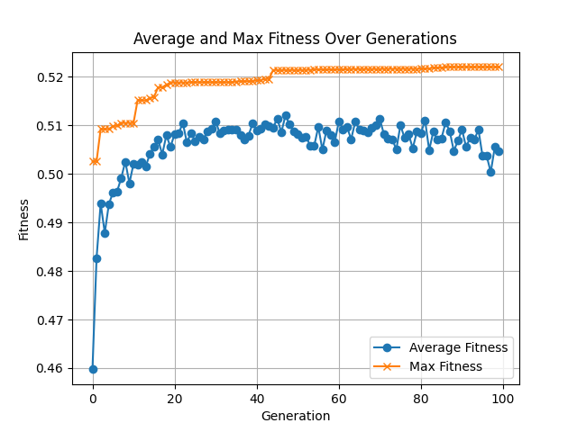
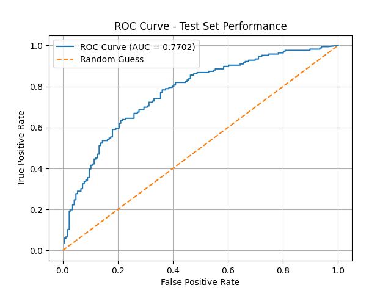

# Predicting NBA game results using Genetic Programming - Dara Newsome and Conor Glynn
This repository aims to predict NBA game results using symbolic regression with genetic programming in Python. The goal here is to evolve mathematical expressions that best fit the historical NBA game data, to be used for game result prediction.
## Requirements
- Python 3.x
- nba_api
- pandas
- tqdm
- matplotlib
## Installation
1. Clone the repository:
    ```bash
    git clone https://github.com/newsyd04/nba-gp-predictor.git
    cd nba-gp-predictor
    ```
2. Create a virtual environment (optional but recommended):
    ```bash
    python -m venv venv
    source venv/bin/activate  # On Windows use `venv\Scripts\activate`
    ```
3. Install the required packages:
    ```bash
    pip install -r requirements.txt
    ```
## Project Structure
- `main.py`: The main script to run the NBA predictor genetic program.
- `tree`: Folder containing tree structure implementations.
    - `tree.py`: Contains the implementation of the tree structure used in the genetic program.
    - `tree_node.py`: Contains the implementation of the nodes used in the tree structure.
- `population.py`: Creates the population of trees.
- `selection`: Folder containing selection methods for the genetic algorithm.
    - `selection_interface.py`: Abstract base class for selection methods.
    - `tournament.py`: Implements tournament selection.
    - `roulette.py`: Implements roulette selection.
- `fitness.py`: Contains the implementation of the fitness functions.
- `evolve`: Folder containing genetic operators.
    - `crossover.py`: Contains crossover methods for the genetic program.
    - `mutation.py`: Contains mutation methods for the genetic program.
- `config.py`: Python file with configuration parameters for the genetic program.
- `data`: Folder containing raw NBA data and related resources.
    - `seasons`: Folder to store NBA season data in CSV files.
    - `teams`: Folder to store NBA team data across the seasons in CSV files.
    - `correlations`: Folder containing png images showing the correlation between NBA advanced statistics and winning.
    - `20XX-20YY`: Folders for each NBA season containing advanced statistics and team data for every game in that season in CSV files.
- `nba_seasons_scraper.py`: Module to scrape NBA season data using nba_api.
- `nba_seasons_helper.py`: Helper functions for processing NBA season data.
- `plot_results.py`: Module to plot the results of the genetic program.
- `results`: Folder to store results as charts generated by the program.
    - `average_and_max_fitness_history.png`: Sample plot of average and max fitness history over generations for a genetic program.
    - `test_roc_curve.png`: Sample ROC curve plot using the test data.
- `requirements.txt`: List of required Python packages.
- `README.md`: This readme file, providing an overview and instructions for the project.
## Usage
To run the NBA predictor genetic program, execute the following command:
```bash
python main.py
```
This will start the genetic program and display the progress towards the optimal solution.
## Configuration
### config.py
#### Genetic Program Parameters
You can modify the parameters in the `config.py` file to customise the genetic program:
e.g.:
```python
PARAMETERS = {
  "population_size": 150,
  "max_tree_height": 8,
  "max_generations": 100,
  "selection_method": "tournament",
  "crossover_rate": 0.9,
  "mutation_rate": 0.1,
  "elitism_rate": 5,
}
```
#### NBA Data Features
You can also modify the features used for NBA prediction in config.py file:
e.g.:
```python
ROLLING_COLUMNS = [
    "netRating",
    "PIE",
    "trueShootingPercentage",
    "effectiveFieldGoalPercentage",
    "turnoverRatio",
    "offensiveReboundPercentage",
    "defensiveReboundPercentage",
    "assistRatio"
]
```
## Results
The results of the genetic program will be printed in the console, showing the average fitness scores over time. Along with this, the best mathematical expression found for predicting NBA game results for each generation will be displayed, with is corresponding fitness score.
A plot of the average and max fitness history will be displayed at the end of the execution and saved in the `results` folder.
A sample plot is shown below:

Additionally, a ROC curve plot using the test data will be generated and saved in the `results` folder.
A sample ROC curve plot is shown below:
